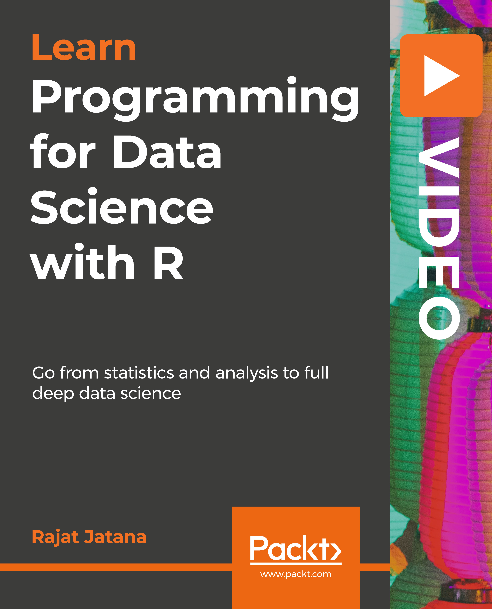

# Programming-for-Data-Science-with-R

  

## Course Overview

This will help candidates having basic knowledge of R Programming elevate to the next level. Here, we will be building on the advanced and efficient ways of doing different parts of analytics- right from data cleaning, visualizing to building high performing models. You’ll get to know advanced and time-saving methods of dealing with each of these. In the end, we’ll blend each of the different components together  with the help of an interesting case study.. 

### Code Index:

1.	[Section 1](Section_1) – Your data science toolkit R
2.	[Section 2](Section_2) – Working with important libraries in R
3.	[Section 3](Section_3) – Manipulating and cleaning data
4.	[Section 4](Section_4) – Building predictive models
5.	[Section 5](Section_5) – Various techniques to boost your model
6.	[Section 6](Section_6) – Let the data talk - Visualizing data
7.	[Section 7](Section_7) – Integrating different components of Data Science- A use case

### Backgroud
Data is everywhere and growing faster than ever before. It has now become challenge to deal with such huge amount of data as it is highly time-consuming. This has created a huge demand for people who can mine and interpret data. There is enormous value in data processing and analysis—and that is where a data scientist steps into the spotlight. 
This course will help candidates having basic knowledge of R Programming elevate to the next level. R can be used to tease actionable insights out of gigabytes of data, and this course will show you exactly how to do it. Here, we will be building on the advanced and efficient ways of doing different parts of analytics- right from data cleaning, visualizing to building high performing models You’ll start your journey by loading data, visualizing it and interpreting it while providing intuitive solutions. Further, you will learn to apply machine learning algorithms to real-world problems in R.

By the end of the course, get geared up to tackle real-life data challenges by analyzing complex datasets. This in turn will bring out insights that companies can convert into actions.
